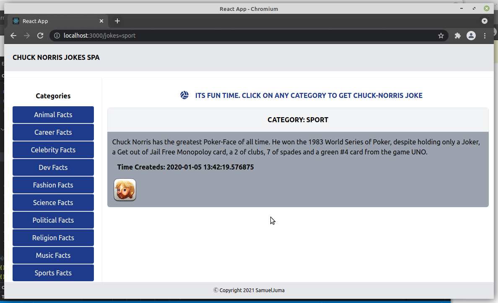

# chuck-norris-spa-react-js

#### The Digital  Apprenticeship Program Cohort I Software Development Challenge Solution

> The app is an SPA solution to the cohort I software development solution from the Digital Apprenticeship Program sponsored by <b>UK Kenya Tech Hub, The ThunderBird Scool of global management and UKaid</b>`

### Motivation
* Am looking up to join the Cohort II Digital Apprenticeship Program. I therefore decided to take on the old challenge as part of prepping for technical inteviews if all goes well. 

### Tech Stack
* This project was bootstrapped with [Create React App](https://github.com/facebook/create-react-app).
* The stack includes
	* [React Js][1] - A free and open-source front-end JavaScript library for building user interfaces or UI components.
	* [Tailwindcss][2] - A utility-first CSS framework for rapidly building custom user interfaces
	* [react-router-dom][3] - A tool that allows you to handle routes in a web app, using dynamic routing
	* [axios][4] - A promise-based HTTP Client for node.js and the browse
	* [font-awesome][5] - Provides a way to add font icons to your website.

### Screenshot
||
|:--:|

[1]: https://github.com/facebook/create-react-app
[2]: https://tailwindcss.com/docs
[3]: https://reactrouter.com/web/guides/quick-start
[4]: https://axios-http.com/docs/intro
[5]: https://fontawesome.com/
